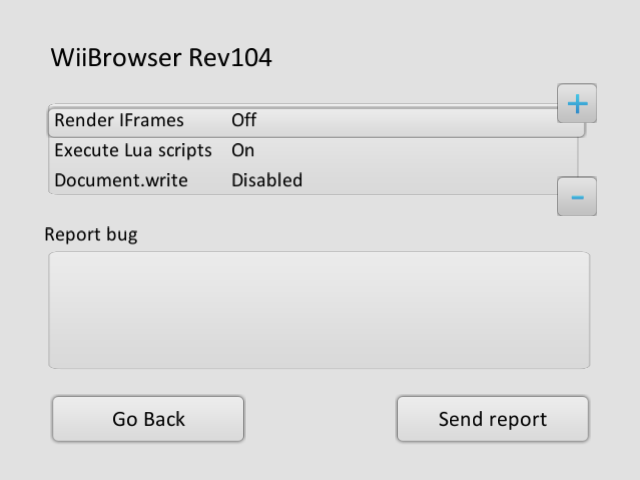
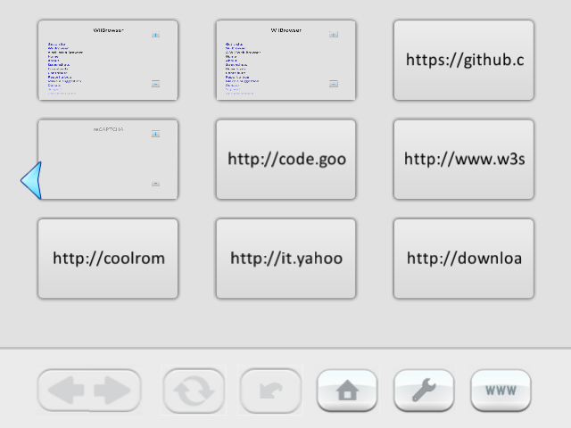
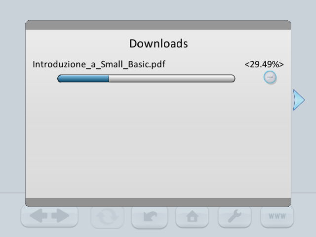
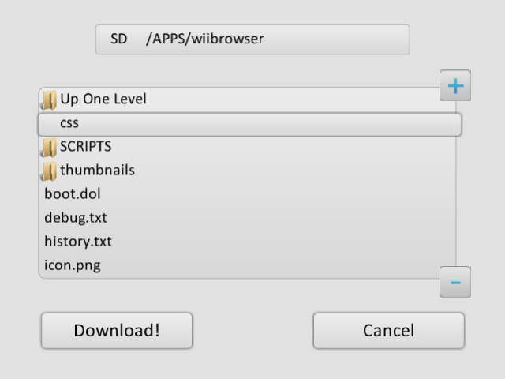
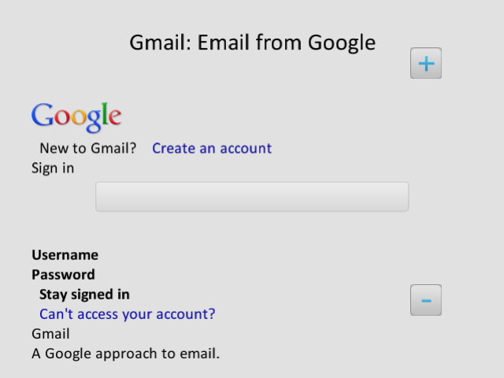
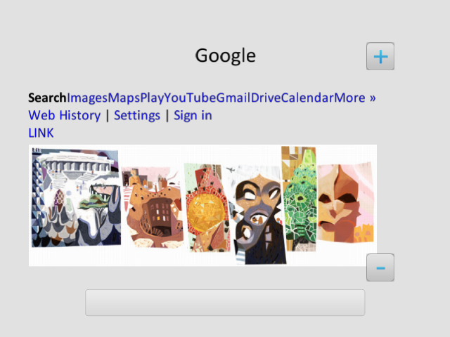
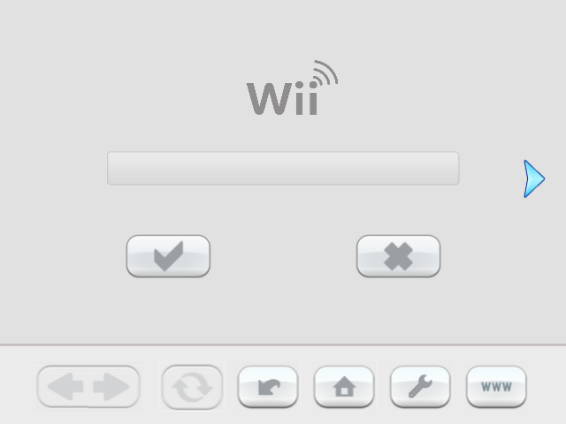
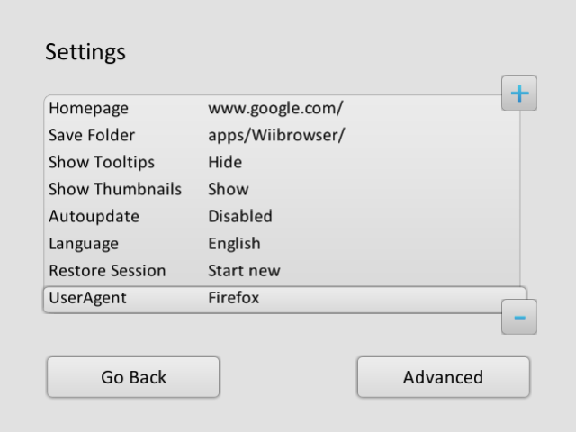

# WiiBrowser Lite
The primary goal of this project is to lay the groundwork to make it easier for other developers to revive WiiBrowser, a homebrew version of the Wii's Internet Channel created by [gave92](https://github.com/gave92).

## Features

### Currently implemented
* View your own web pages
* Basic HTTP and HTTPS connection support
* Links and web form support
* Bookmarks
* Import/Export of bookmarks
* Basic rendering of HTML 4.01 and CSS2
* Download support to an SD/SDHC card
* Upload support
* Address bar with on-screen keyboard
* Keyboard auto-completion
* Forward and back navigation
* PNG/JPEG/GIF/BMP image support
* ZIP/RAR/7Z extraction
* Moving and resizing images
* Auto-refresh

### Planned
* Better HTML/CSS rendering
* JavaScript support
* Full video support
* Multiple tabs

## Building

See [BUILD.md](BUILD.md) and [ARCHITECTURE.md](ARCHITECTURE.md). Quick start (requires devkitPPC):

```sh
export DEVKITPRO=/opt/devkitpro
export DEVKITPPC=$DEVKITPRO/devkitPPC
make
make forwarder   # optional forwarder channel
```

`external/mplayer` is a git submodule (disabled by default, see `external/mplayer/README.md`). Compressed assets from `assets/` are embedded via `scripts/embeddata.sh`.

## Screenshots
<p>       </p>

## Credits
- [Dimok](https://github.com/dimok789) for [WiiXplorer](https://sourceforge.net/projects/wiixplorer/) which WiiBrowser was both inspired by and took code from for file management
- [dborth](https://github.com/dborth) for the graphics library [libwiigui](https://github.com/dborth/libwiigui) and the original [WiiMC](https://github.com/dborth/wiimc), which WiiBrowser took code from for media support
- [SuperrSonic](https://github.com/SuperrSonic) for [WiiMC-SSLC](https://github.com/SuperrSonic/WiiMC-SSLC), parts of which WBL uses for media support
- [The LiteHTML contributors](https://github.com/litehtml) for the lightweight HTML renderer used by WBL

## Links
- GBATemp thread: https://gbatemp.net/threads/wii-browser.342634/
- Original webpage (archived): https://web.archive.org/web/20131002190414/http://wiibrowser.altervista.org/mainsite/index.html
- Original source code (archived): https://code.google.com/archive/p/wiibrowser/
